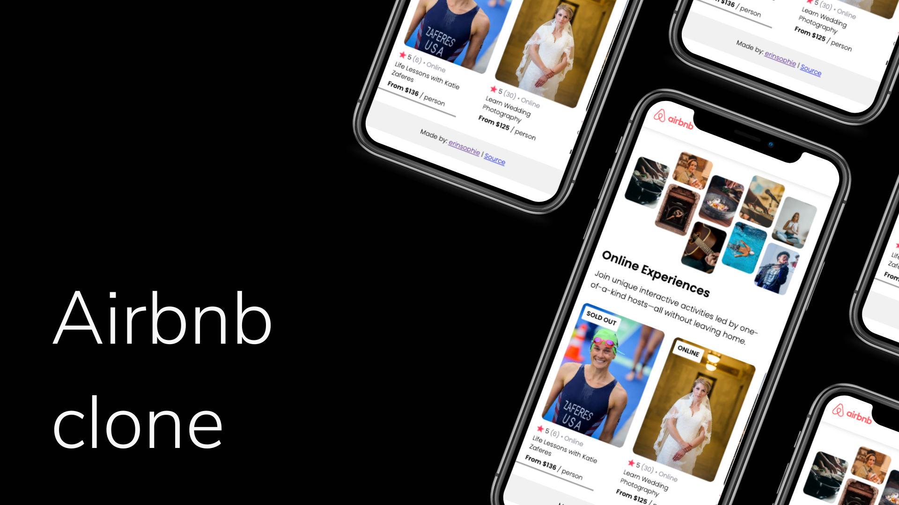

# Airbnb Clone

## [Live Demo](https://erinsophie.github.io/airbnb-clone/)

# Technologies Used 

- HTML
- CSS
- Javascript
- React

# Project goals

My first React app!

The first project in Scrimba's Learn React course is this Airbnb clone. The task was to create a mobile version of the site's Experiences page with the goal of learning about the key fundamentals in React.

I expanded on the idea by also making it desktop-friendly and adding more cards and various other elements such as the pop up descriptions. 
